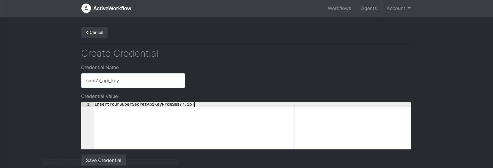
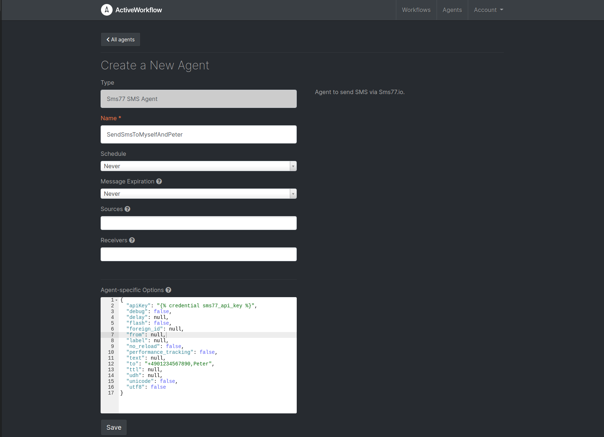

# Official Voice Agent for [Active Workflow](https://github.com/automaticmode/active_workflow)

A custom agent using the remote API from Active Workflow. 
Please notice that scheduling does nothing 
even though the agent interface might not reflect that.

## Installation
**Start Flask:**

`python3.8 main.py`

**Expose remote agent URL in environment**

`export REMOTE_AGENT_URL="http://localhost:5000/"`

**Create a new user credential**

The API key can alternatively be stored as environment variable 
SMS77_API_KEY on the Flask server. In this case you can go on to the next step.

Go to /user_credentials/new

Credential Name: sms77_api_key

Credential Value: Your API key from Sms77.io

**Create a new agent**

Create a new agent with options in the format of:

The option apiKey may also be defined as environment variable SMS77_API_KEY.

### Development
**Start Flask:**

`python3.8 main.py`

**Start Active Workflow:**

`docker run --network host -e REMOTE_AGENT_URL=$REMOTE_AGENT_URL -p 3000:3000 --rm -v aw-data:/var/lib/postgresql/11/main automaticmode/active_workflow`

#### Support
Need help? Feel free to [contact us](https://www.sms77.io/en/company/contact/).

