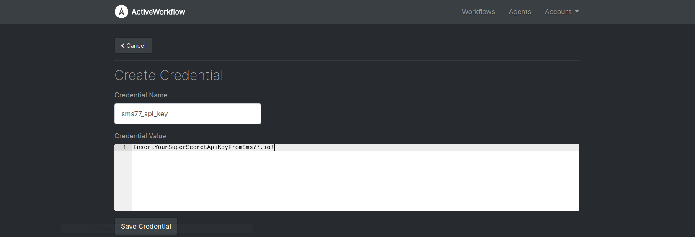
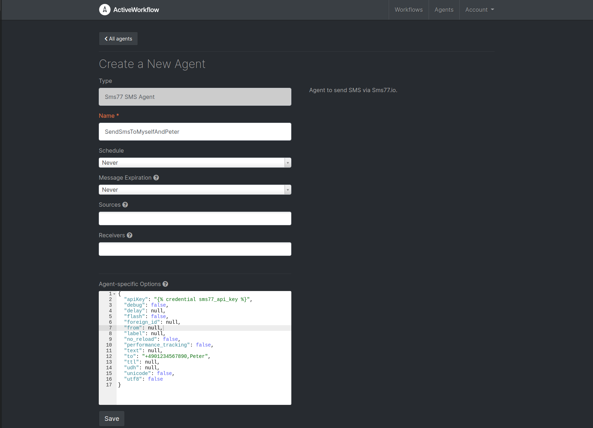

<p align="center">
  
</p>

<h1 align="center">seven Voice for Active Workflow</h1>

<p align="center">
  Official remote agent for <a href="https://github.com/automaticmode/active_workflow">Active Workflow</a> that places text-to-speech calls via the seven gateway.
</p>

<p align="center">
  <a href="LICENSE"></a>
  
  
</p>

---

## Features

- **Voice / Text-to-Speech Calls** - Trigger automated phone calls from any Active Workflow scenario
- **Credential or Env Auth** - Pass the API key as user credential or as `SEVEN_API_KEY` environment variable
- **Self-hosted Flask service** - Runs alongside your Active Workflow instance with no external dependencies

> **Note:** The Active Workflow remote-agent API does not support scheduling. The agent UI may show scheduling options - they are intentionally non-functional.

## Prerequisites

- Python 3.8+
- An Active Workflow instance reachable from the agent host
- A [seven account](https://www.seven.io/) with API key ([How to get your API key](https://help.seven.io/en/developer/where-do-i-find-my-api-key))

## Installation

### 1. Clone and start the Flask agent

```bash
git clone https://github.com/seven-io/active-workflow-voice.git
cd active-workflow-voice
pip install -r requirements.txt
python3.8 main.py
```

The agent listens on `http://localhost:5000/`.

### 2. Expose the agent URL to Active Workflow

```bash
export REMOTE_AGENT_URL="http://localhost:5000/"
```

### 3. Run Active Workflow

```bash
docker run --network host \
  -e REMOTE_AGENT_URL=$REMOTE_AGENT_URL \
  -p 3000:3000 --rm \
  -v aw-data:/var/lib/postgresql/11/main \
  automaticmode/active_workflow
```

## Configuration

### Option A: User credential

In Active Workflow open `/user_credentials/new` and create:

| Field | Value |
|-------|-------|
| Credential Name | `seven_api_key` |
| Credential Value | Your seven API key |



### Option B: Environment variable

Set `SEVEN_API_KEY` on the host running `main.py` and skip the credential step entirely.

## Usage

Create a new agent in Active Workflow and pick the seven Voice agent type. The minimum option set is:



`apiKey` may also be omitted if `SEVEN_API_KEY` is exported on the agent host.

## Support

Need help? Feel free to [contact us](https://www.seven.io/en/company/contact/) or [open an issue](https://github.com/seven-io/active-workflow-voice/issues).

## License

[MIT](LICENSE)
